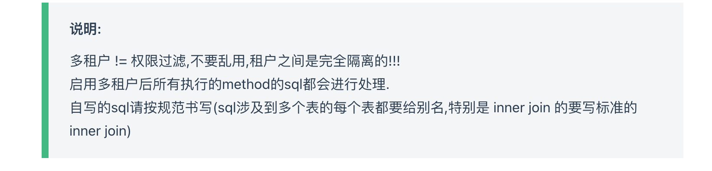

## Mybatis plus 多租户

#### 介绍

官网： [简介 | MyBatis-Plus (baomidou.com)](https://baomidou.com/guide/)

#### 官方多租户使用

mybatis plus  官方多租户使用方法，是通过实现TenantLineHandler 接口，实现tenantId的获取方法。

```java
public interface TenantLineHandler {

    /**
     * 获取租户 ID 值表达式，只支持单个 ID 值
     * <p>
     *
     * @return 租户 ID 值表达式
     */
    Expression getTenantId();

    /**
     * 获取租户字段名
     * <p>
     * 默认字段名叫: tenant_id
     *
     * @return 租户字段名
     */
    default String getTenantIdColumn() {
        return "tenant_id";
    }

    /**
     * 根据表名判断是否忽略拼接多租户条件
     * <p>
     * 默认都要进行解析并拼接多租户条件
     *
     * @param tableName 表名
     * @return 是否忽略, true:表示忽略，false:需要解析并拼接多租户条件
     */
    default boolean ignoreTable(String tableName) {
        return false;
    }
}
```

使用时，在MybatisPlusInterceptor里使用配置上即可

```java
 @Bean
    public MybatisPlusInterceptor mybatisPlusInterceptor() {
        MybatisPlusInterceptor interceptor = new MybatisPlusInterceptor();
        interceptor.addInnerInterceptor(new TenantLineInnerInterceptor(new TenantLineHandler() {
            @Override
            public Expression getTenantId() {
                return new LongValue(1L); //最简单实现
            }
        }));
        interceptor.addInnerInterceptor(new PaginationInnerInterceptor(DbType.H2));
        return interceptor;
    }
```

#### 官方多租户实现原理

mybatis plus 官方实现是使用jsqlparser解析sql成语法树，在JsqlParserSupport抽象类中对sql类型的判断，然后进行不同的处理。

```java
/**
 * 执行 SQL 解析
 *
 * @param statement JsqlParser Statement
 * @return sql
 */
protected String processParser(Statement statement, int index, String sql, Object obj) {
    if (logger.isDebugEnabled()) {
        logger.debug("SQL to parse, SQL: " + sql);
    }
    if (statement instanceof Insert) {
        this.processInsert((Insert) statement, index, sql, obj);
    } else if (statement instanceof Select) {
        this.processSelect((Select) statement, index, sql, obj);
    } else if (statement instanceof Update) {
        this.processUpdate((Update) statement, index, sql, obj);
    } else if (statement instanceof Delete) {
        this.processDelete((Delete) statement, index, sql, obj);
    }
    sql = statement.toString();
    if (logger.isDebugEnabled()) {
        logger.debug("parse the finished SQL: " + sql);
    }
    return sql;
}
```

在mybatis plus的 TenantLineInnerInterceptor 中 继承了JsqlParserSupport 并实现了4种sql的处理方法， 实现了InnerInterceptor 中的beforeQuery（查询） 和 beforePrepare（增加、删除、更新）。

#### 官方多租户缺陷

jsqlparser 对sql 要求比较严格，在 join 语句的处理上存在限制


官方文档中也对此做出了说明



#### 多租户sql处理 的优化

改用 druid 对sql 进行处理

##### 解析sql

自定义sql的解析方法

```java
    public String parserSingle(String sql, Object obj) {
        deBug(sql, "original");
        Long start,end;
        start = System.currentTimeMillis();
        H2StatementParser parser = new H2StatementParser(sql);
        end = System.currentTimeMillis();
        System.err.println(end-start);
        SQLStatement stmt = parser.parseStatement();
        return processParser(stmt, obj);
    }

    protected String processParser(SQLStatement stmt, Object obj) {
        // 查询语句
        if (stmt instanceof SQLSelectStatement) {
            processSelect((SQLSelectStatement) stmt, obj);
        }
        // 更新语句
        else if (stmt instanceof SQLUpdateStatement) {
            processUpdate((SQLUpdateStatement) stmt, obj);
        }
        //删除语句
        else if (stmt instanceof SQLDeleteStatement) {
            processDelete((SQLDeleteStatement) stmt, obj);
        }
        //插入语句
        else if (stmt instanceof SQLInsertStatement) {
            processInsert((SQLInsertStatement) stmt, obj);
        }
        String sql = stmt.toString();
        deBug(sql, "after process");
        final String replaceSql = sql.replace(String.valueOf(Long.MIN_VALUE), String.valueOf(tenantLineHandler.getTenantId()));
        deBug(replaceSql, "replaceSql");
        return replaceSql;
    }
```

##### 自定义拦截器

```java
public class ConditionSqlParserInnerInterceptor extends DruidParserSupport implements InnerInterceptor {}
```

##### insert 、update 、delete 处理

使用druid提供api，轻松搞定

```java
    @Override
    protected void processInsert(SQLInsertStatement insert, Object obj) {
        final List<SQLInsertStatement.ValuesClause> valuesList = insert.getValuesList();
        insert.addColumn(new SQLIdentifierExpr(TABLE_FIELD_TENANT_ID));
        valuesList.forEach(valuesClause -> valuesClause.addValue(1));
    }

    @Override
    protected void processDelete(SQLDeleteStatement delete, Object obj) {
        final String alias = delete.getAlias();
        final SQLName tableName = delete.getTableName();
        final SourceFromInfo fromInfo = SourceFromInfo.builder().alias(alias).tableName(tableName.getSimpleName()).build();
        final SQLBinaryOpExpr tenantIdCondition = SqlParseUtil.generateTenantIdCondition(fromInfo);
        delete.setWhere(processWhereSubQuery(delete.getWhere()));
        delete.addCondition(tenantIdCondition);
    }

    @Override
    protected void processUpdate(SQLUpdateStatement update, Object obj) {
        final SQLName tableName = update.getTableName();
        final SourceFromInfo fromInfo = SourceFromInfo.builder().tableName(tableName.getSimpleName()).build();
        final SQLBinaryOpExpr tenantIdCondition = SqlParseUtil.generateTenantIdCondition(fromInfo);
        update.setWhere(processWhereSubQuery(update.getWhere()));
        update.addCondition(tenantIdCondition);
    }
```

##### select语句的处理

对select 语句的 查询字段列表、from 语句、where 语句 进行分开处理，只要在其中遇到子查询就递归处理

```java
        List<String> tableList = new ArrayList<>();   
				// 处理查询字段中的子查询
        processSelectList(select);
        // 处理from语句
        processFrom(select, tableList);
        // 处理where 条件
        processWhere(select, tableList);
```

在主select 语句中对 on 语句 和 where 语句中添加租户条件

```java
  /**
     * 处理on的sql
     *
     * @param joinFrom
     * @param tableList
     */
    private void processFromOn(SQLJoinTableSource joinFrom, List<String> tableList) {
        final SQLExprTableSource fromRight = (SQLExprTableSource) joinFrom.getRight();
        final SourceFromInfo fromInfo = SourceFromInfo
                .builder()
                .tableName(fromRight.getTableName())
                .alias(fromRight.getAlias())
                .build();
        final SQLBinaryOpExpr condition = SqlParseUtil.generateTenantIdCondition(fromInfo);
        if (joinFrom.getCondition() != null) {
            joinFrom.addCondition(condition);
            tableList.add(SqlParseUtil.getTableName(fromRight));
        }
    }


```

已经在 on里 添加了过的，不需要在where里添加

```java
  private void doProcessWhere(SQLSelectQueryBlock select, SQLExpr where, List<String> tableList) {
        final SQLTableSource from = select.getFrom();
        List<SourceFromInfo> tableNameList = new ArrayList<>();
        getTableNames(from, tableNameList);
        tableNameList = tableNameList.stream()
                .filter(next -> !tableList.contains(next.getAlias()) && !tableList.contains(next.getTableName()))
                .distinct()
                .collect(Collectors.toList());
        // 根据多个表名获取拼接条件
        SQLBinaryOpExpr conditionByTableName = generateWhereConditionByTableList(tableNameList);
        where = SqlParseUtil.generateCondition(where, conditionByTableName, SQLBinaryOperator.BooleanAnd);
        select.setWhere(where);
    }
```

##### 解析优化

使用本地缓存对sql解析结果进行保存，因为此时处理的sql为预编译的sql，参数还是 ？占位符，使用缓存可以大大优化同类sql的解析

效率

```java
    /**
     * 处理基本查询
     *
     * @param
     */
    private void processPlainSelect(SQLSelectQueryBlock select) {
        final String sql = select.toString();
        final SQLSelectQueryBlock sqlSelectQueryBlock = selectCache.getIfPresent(sql);
        if (ObjectUtils.isNotEmpty(sqlSelectQueryBlock)) {
            log.info("使用了缓存---");
            select.setCachedSelectList(sqlSelectQueryBlock.getCachedSelectList(), sqlSelectQueryBlock.getCachedSelectListHash());
            select.setFrom(sqlSelectQueryBlock.getFrom());
            select.setWhere(sqlSelectQueryBlock.getWhere());
            return;
        }
        List<String> tableList = new ArrayList<>();
        // 处理查询字段中的子查询
        processSelectList(select);
        // 处理from语句
        processFrom(select, tableList);
        // 处理where 条件
        processWhere(select, tableList);
        selectCache.put(sql, select);
    }
```

使用缓存后造成的问题，因为不同租户添加的租户id 不同，使用缓存会拿到错误的租户id，解决办法，先用一个不存在的租户占位，然后解析完后，在进行租户替换。

```java
  public static SQLBinaryOpExpr generateTenantIdCondition(SourceFromInfo tableNameInfo) {
        SQLBinaryOpExpr tenantIdWhere = new SQLBinaryOpExpr(MYSQL_STRING);
        if (StringUtils.isEmpty(tableNameInfo.getAlias())) {
            // 拼接新的条件
            tenantIdWhere.setLeft(new SQLPropertyExpr(tableNameInfo.getTableName(), TABLE_FIELD_TENANT_ID));
            // 设置当前租户ID条件
        } else {
            // 拼接别名条件
            tenantIdWhere.setLeft(new SQLPropertyExpr(tableNameInfo.getAlias(), TABLE_FIELD_TENANT_ID));
        }
        tenantIdWhere.setOperator(SQLBinaryOperator.Equality);
        tenantIdWhere.setRight(new SQLIntegerExpr(Long.MIN_VALUE)); // 租户的占位
        return tenantIdWhere;
    }
```

```java
 String sql = stmt.toString();
        deBug(sql, "after process");
        final String replaceSql = sql.replace(String.valueOf(Long.MIN_VALUE), String.valueOf(tenantLineHandler.getTenantId()));
        deBug(replaceSql, "replaceSql");
```

##### 性能测试

###### 测试select sql

```sql
select id from a left join h on h.sex = a.sex  left join (select * from f ,( select * from d ) ) b  on b.name = a.name left join c c1  on c1.name = b.name  where id in  (select * from g where  name in ( select * from k)) union all select * from p
```

解析后

```sql
SELECT id
FROM a
	LEFT JOIN h
	ON h.sex = a.sex
		AND h.tenant_id = 1
	LEFT JOIN (
		SELECT *
		FROM f, (
				SELECT *
				FROM d
				WHERE d.tenant_id = 1
			)
		WHERE f.tenant_id = 1
	) b
	ON b.name = a.name
	LEFT JOIN c c1
	ON c1.name = b.name
		AND c1.tenant_id = 1
WHERE id IN (
		SELECT *
		FROM g
		WHERE name IN (
				SELECT *
				FROM k
				WHERE k.tenant_id = 1
			)
			AND g.tenant_id = 1
	)
	AND a.tenant_id = 1
UNION ALL
SELECT *
FROM p
WHERE p.tenant_id = 1
```

第一次处理耗时 200-300ms

使用缓存后耗时 <5ms

###### 测试 inertsql

```sql
INSERT INTO user  ( id,name,age,email )  VALUES  ( ?,?,?,? )
```

解析后

```sql
INSERT INTO user (id, name, age, email, tenant_id) VALUES (?, ?, ?, ?, 1)
```

###### 测试update sql

```sql
UPDATE user  SET name=?,age=?,email=? WHERE (age = ?)
```

解析后

```sql
UPDATE user SET name = ?, age = ?, email = ? WHERE age = ? AND user.tenant_id = 1
```

###### 测试delete sql

```sql
DELETE FROM user WHERE (age = ? AND name = ?)
```

解析后

```sql
DELETE FROM user
WHERE age = ?
	AND name = ?
	AND user.tenant_id = 1
```


#### TenantLineHandler优化

使用druid 后修改TenantLineHandler 的 直接返回long

```java
    /**
     * 获取租户 ID 值表达式，只支持单个 ID 值
     * <p>
     *
     * @return 租户 ID
     */
    Long getTenantId();
```

tenant_id继续使用ThreadLocal实现,其余框架，需要设计拦截器，在拦截器中实现tenant_id的设置来实现无感知。

#### @WithoutTenant 

可能有一些操作的sql 需要跨租户，可在方法上加上此注解

```java
@Documented
@Target(ElementType.METHOD)
@Retention(RetentionPolicy.RUNTIME)
public @interface WithoutTenant {
}

@Slf4j
@Aspect
@AllArgsConstructor
public class WithoutTenantAspect {

    @Around("@annotation(com.convertlab.multitenancystater.annotation.WithoutTenant)")
    public Object doWithoutTenant(ProceedingJoinPoint proceedingJoinPoint) {
        final String tenant = TenantContext.getCurrentTenant();
        try {
            TenantContext.clear();
            Object object =  proceedingJoinPoint.proceed();
            return object;
        } catch (Throwable throwable) {
            throwable.printStackTrace();
        } finally {
            TenantContext.setCurrentTenant(tenant);
        }
        return null;
    }
}
```


